# Battleships
Battleships is a game coded in Python, which runs in the Code Institute Heroku mock terminal, in which the user competes with the computer to find all their ships first.

The game is played on a ten-by-ten board, with five ships of length 2-5 squares (based on the classic board game). The user sets the positions for each of their ships, while the computer randomly generates theirs, before they take turn guessing coordinates to try to find the other's ships first and win the game.

Final app: [https://battleships-mj.herokuapp.com/](https://battleships-mj.herokuapp.com/)

## Table of contents

- [How to play](#how-to-play)
- [User goals](#user-goals)
- [Owner goals](#owner-goals)
- [Features](#features)
- [Style choices](#style-choices)
- [Future improvements](#future-improvements)
- [Testing](#testing)
- [Deployment](#deployment)
- [Credits](#credits)

## How to play
The user enters their name and selects the positions for each ship, and the computer randomly generates positions for each of theirs.
The user and computer take turns to guess a coordinate, and a new board is printed each time.
Key:
○ --> Unguessed coordinate
⊗ --> Correctly guessed coordinate
~ --> Incorrectly guessed coordinate
⬤ --> Unguessed coordinate where ship is positioned (user board only)

The first to guess all ship coordinates wins the game.

## User goals
- To be able to play a classic game of battleships.
- To be able to play against a computer.
- To be able to set the position of each ship.
- To be able to see updated boards after each round (both computer and user boards).
- To receive additional feedback after each turn telling them if they hit a ship or not.
- To receive additional feedback after each computer turn telling them if the computer hit a ship or not.
- To be told at the end of each game if they have won or lost.
- To be able to set a username.

## Owner goals
- To provide a classic game of battleships.
- To build a game that can be changed and improved over time.

## Features
- User instructions upon loading
    - Instructions are already loaded so user can read them immediately and at their own speed before proceeding.
    - User can then input 'Y' or 'N' to either start the game or exit the app (also accepts 'y' or 'n').

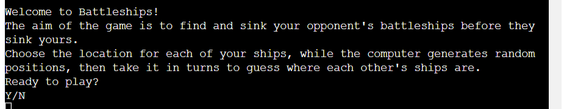

- Username
    - User must input a username to play the game.
    - Username must be minimum 3 characters and only contain alphanumeric characters.
    - Username is then used to label each print of the user's board.

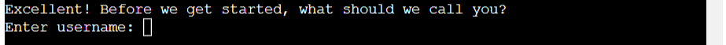

- Board
    - Board size is 10 by 10 to match classic board size.
    - Columns are labelled with the corresponding letter and rows are labelled with the corresponding number so the user can easily see the coordinate for each position.
    - A-J and 1-10 are used instead of 0-9 for both columns and rows to match classic game coordinates and to be more intuitive for the user.
    - For each row number 1-9, there is a space between the number and the first '|' to make sure the board is aligned.

- Ships
    - Ship names and lengths are based on the 2002 Hasbro version of battleships, as listed on [Wikipedia](https://en.wikipedia.org/wiki/Battleship_(game)).

- Set coordinates
    - User sets the coordinates of each ship by entering the column and row for the first coordinate, then choosing the direction of the ship (horizontal or vertical).
    - The program will accept both uppercase and lowercase letters for the column selection.
    - The user will be told which ship they are positioning, and how long that ship is.
    - An updated user board will print to show the positioned ships.

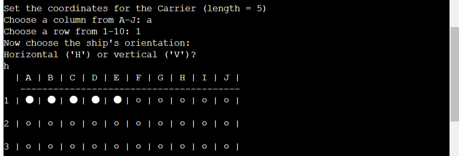

- Generate computer coordinates
    - Computer randomly generates coordinates for each ship.
    - 'Setting computer coordinates for [ship name]...' is printed to the console for each ship set by the computer.
    - Sleep function is used between each one to give the impression that the computer is 'thinking' about each ship placement.
    - A blank computer board is then printed to show that no user guesses have yet been made.

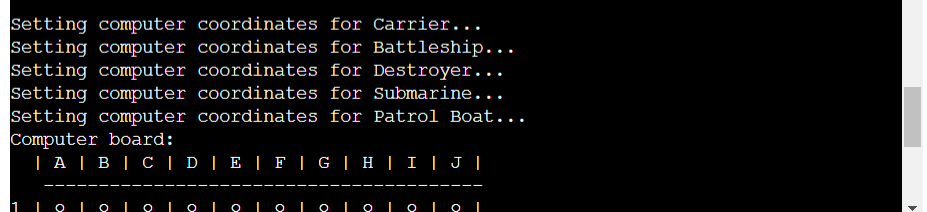

- Guess coordinate
    - User inputs column letter and row number to guess coordinate.
    - Computer randomly generates numbers from 0-9 to guess column and row numbers. These will be converted to a letter and number coordinate and printed.
    - Program checks if coordinate has already been guessed (in which case the user will guess again or the computer will generate a new coordinate, as applicable), and if the coordinate is a hit or a miss.
    - An updated board prints showing all guessed coordinates, which different symbols depending on whether they hit a ship or not. The user board with computer guesses will also show unguessed ship coordinates.

User guess:

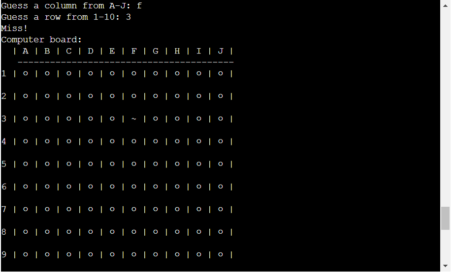

User guesses duplicate coordinate:

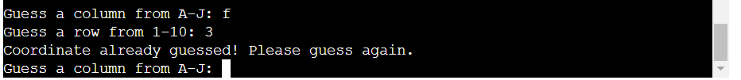

Compuer guess:

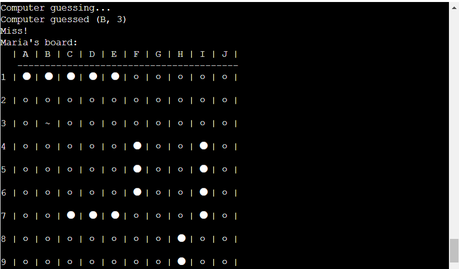

Updated computer board with guessed coordinates:

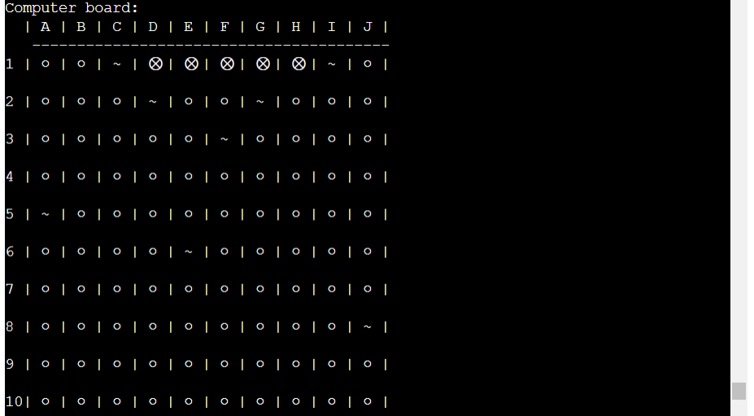

Updated user board with guessed coordinates and remaining ships:

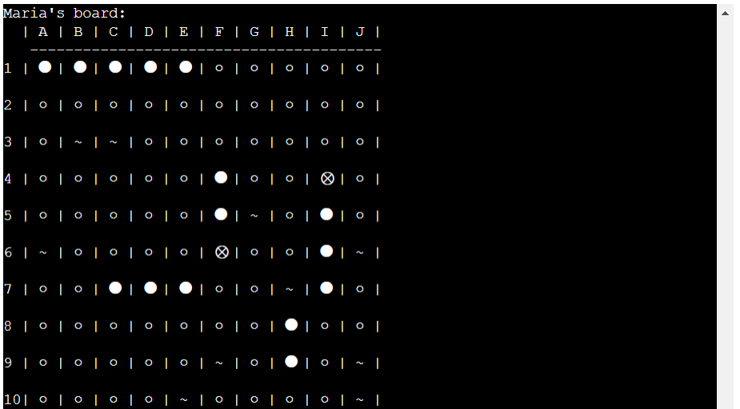

- Declare winner
    - Checks after each turn if all ships have been fully uncovered. If so, the winner is declared.
    - Gives the user the option to either play again, or exit.

User wins:

Computer wins:

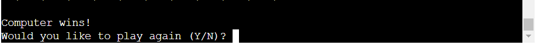

## Style choices
- Board size, ship names and lengths: based on 2002 Hasbro version of battleships.
- Column letters and row numbers: easier for a user to use than 0-9 (more familiar/intuitive).
- Different board symbols: each is visually different to the others and it's clear to the user what the status of each coordinate is.

## Future improvements
1. Set different computer difficulties and give the user the option to select - i.e., a harder difficulty will have the computer guesses based on previous correct guesses, and an easier difficulty might have a smaller board.
2. Give the user the option to either play against a second person instead of the computer.
3. On a bigger window, the boards could be printed side-by-side to reduce the need for scrolling up to look at the boards.

## Testing
### Bugs found and fixed during development

| Bug | Fix |
| --- | --- |
| Instruction text at start of game is missing spaces and has line breaks in the middle of words (see yellow highlights): 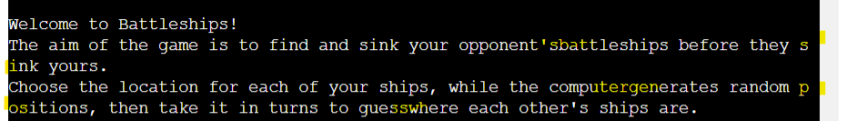 | Added missing spaces (no need to add line breaks as extra spaces pushed start of split words onto a new line): 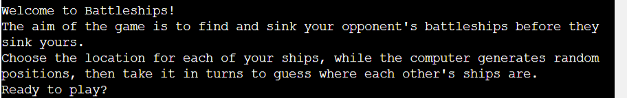 |
| When the computer guesses a coordinate that has already been guessed, its turn ends without guessing again: 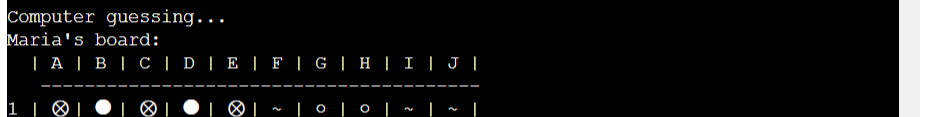 | Added a loop to run the computer guess function until a valid coordinate is generated, and reset the guess if it has already been guessed so a new coordinate is generated each turn: 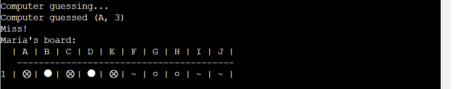 |
| If the user wins, they are declared the winner but the game continues: 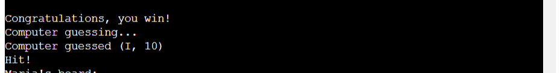 | Put the computer turn inside the 'else' of the 'if...else' statement checking if the user has won:  |

### Remaining bugs
None

### Input validation

| Input | Results |
| --- | --- |
| Start game: empty input, invalid non-empty input, valid input | 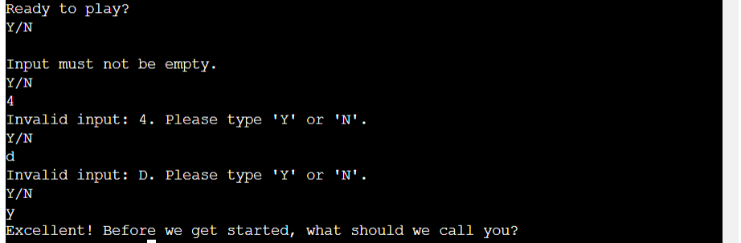 |
| Enter username: empty input, input < 3 characters, non-alphanumeric input, valid input |  |
| Set column: empty input, non-alpha input, input > 1 character, letter outside of accepted values, valid input | 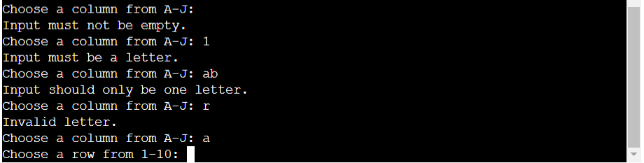 |
| Set row: empty input, non-numeric input, input < 1, input > 10, valid input |  |
| Set orientation: empty input, invalid non-empty input, valid input | 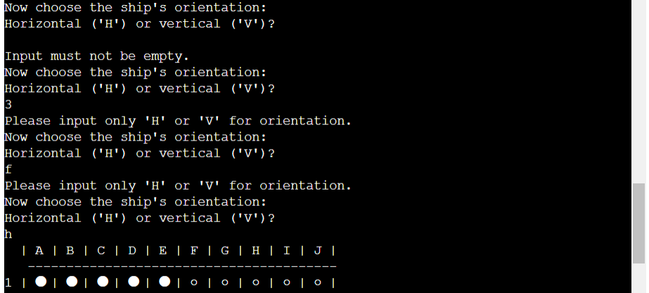 |
| Guess column: empty input, non-alpha input, input > 1 character, letter outside of accepted values, valid input | 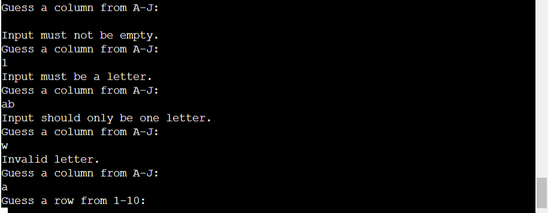 |
| Guess row: empty input, non-numeric input, input < 1, input > 10, valid input | 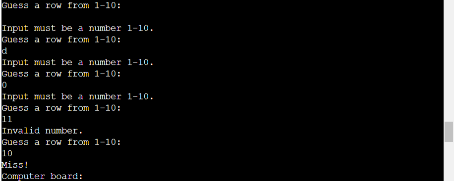 |

### Validator testing
- PEP8
    - No bugs or problems found when passed through PEP8 linter:
    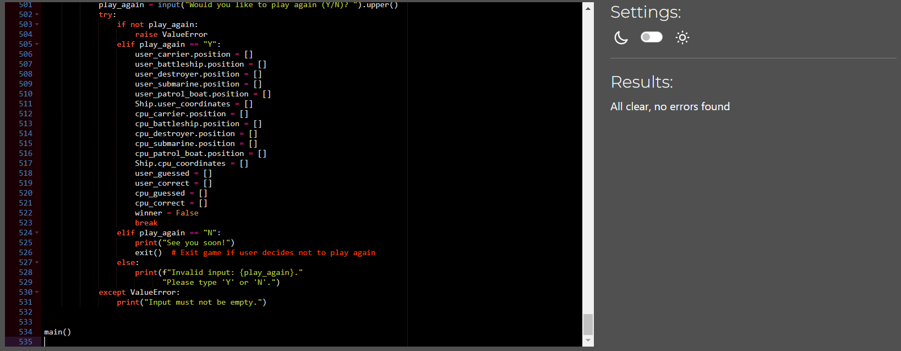

## Deployment
This app was deployed using Heroku:
1. Fork or clone this repository.
2. Create and name a new app on Heroku (name must be unique), and select your region (Europe or United States).
3. Go to settings, and add a new Config Var (key = PORT, value = 8000).
4. Add python and nodejs buildpacks (make sure they are in this order).
5. Go to deploy, select Github and link this repository.
6. Optionally enable automatic deploys, and click Deploy Branch to manually deploy the app.

## Credits
- Code Institute gitpod template and Heroku deployment terminal.
- Wikipedia for information on classics battleships game.
- Can Sucullu as my mentor.
