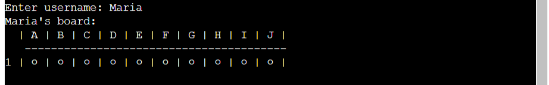
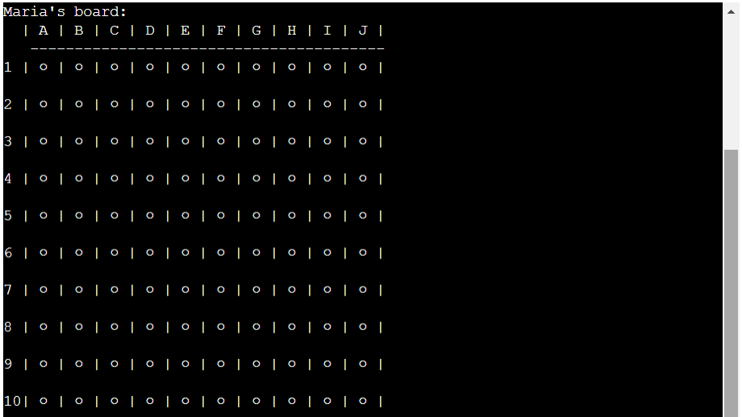
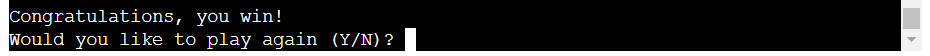

# Battleships

## Table of contents

- [User goals](#user-goals)
- [Owner goals](#owner-goals)
- [Features](#features)
- [Deployment](#deployment)
- [Testing](#testing)
- [Future improvements](#future-improvements)
- [Credits](#credits)

## User goals
- To be able to play a classic game of battleships.
- To be able to play against a computer.
- To be able to set the position of each ship.
- To be able to see updated boards after each round (both computer and user boards).
- To receive additional feedback after each turn telling them if they hit a ship or not.
- To receive additional feedback after each computer turn telling them if the computer hit a ship or not.
- To be told at the end of each game if they have won or lost.
- To be able to set a username.

## Owner goals
- To provide a classic game of battleships.
- To build a game that can be changed and improved over time.

## Features
- User instructions upon loading
    - Instructions are already loaded so user can read them immediately and at their own speed before proceeding.
    - User can then input 'Y' or 'N' to either start the game or exit the app (also accepts 'y' or 'n').

- Username
    - User must input a username to play the game.
    - Username must be minimum 3 characters and only contain alphanumeric characters.
    - Username is then used to label each print of the user's board.

- Board
    - Board size is 10 by 10 to match classic board size.
    - Columns are labelled with the corresponding letter and rows are labelled with the corresponding number so the user can easily see the coordinate for each position.
    - A-J and 1-10 are used instead of 0-9 for both columns and rows to match classic game coordinates and to be more intuitive for the user.
    - For each row number 1-9, there is a space between the number and the first '|' to make sure the board is aligned.

- Ships
    - Ship names and lengths are based on the 2002 Hasbro version of battleships, as listed on [Wikipedia](https://en.wikipedia.org/wiki/Battleship_(game)).

- Set coordinates
    - User sets the coordinates of each ship by entering the column and row for the first coordinate, then choosing the direction of the ship (horizontal or vertical).
    - The program will accept both uppercase and lowercase letters for the column selection.
    - The user will be told which ship they are positioning, and how long that ship is.
    - An updated user board will print to show the positioned ships.

- Generate computer coordinates
    - Computer randomly generates coordinates for each ship.
    - 'Setting computer coordinates for [ship name]...' is printed to the console for each ship set by the computer.
    - Sleep function is used between each one to give the impression that the computer is 'thinking' about each ship placement.
    - A blank computer board is then printed to show that no user guesses have yet been made.

- Guess coordinate
    - User inputs column letter and row number to guess coordinate.
    - Computer randomly generates numbers from 0-9 to guess column and row numbers. These will be converted to a letter and number coordinate and printed.
    - Program checks if coordinate has already been guessed (in which case the user will guess again or the computer will generate a new coordinate, as applicable), and if the coordinate is a hit or a miss.
    - An updated board prints showing all guessed coordinates, which different symbols depending on whether they hit a ship or not. The user board with computer guesses will also show unguessed ship coordinates.

User guess:

User guesses duplicate coordinate:

Compuer guess:

Updated computer board with guessed coordinates:

Updated user board with guessed coordinates and remaining ships:

- Declare winner
    - Checks after each turn if all ships have been fully uncovered. If so, the winner is declared.
    - Gives the user the option to either play again, or exit.

User wins:

Computer wins:

## Deployment

## Testing
### Bugs found and fixed during development

| Bug | Fix |
| --- | --- |
| Instruction text at start of game is missing spaces and has line breaks in the middle of words (see yellow highlights):  | Added missing spaces (no need to add line breaks as extra spaces pushed start of split words onto a new line):  |
| When the computer guesses a coordinate that has already been guessed, its turn ends without guessing again:  | Added a loop to run the computer guess function until a valid coordinate is generated, and reset the guess if it has already been guessed so a new coordinate is generated each turn:  |

## Future improvements

## Credits
